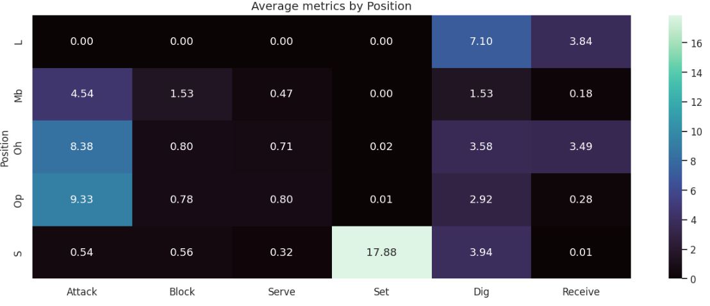
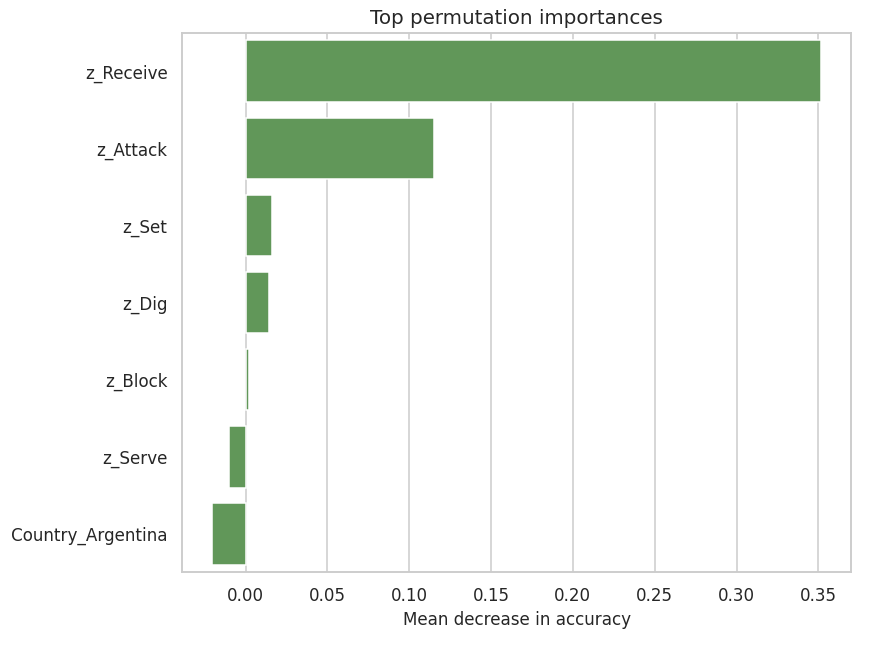
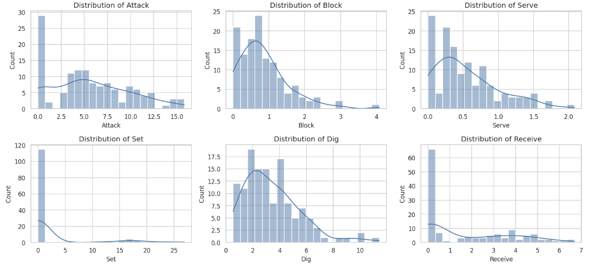

# VNL Men 2023 – Data Analysis

**Role:** Senior Data Scientist – Performance Analytics  
**Project Context:** Part of the Volleyball Nations League Men 2023 analytical unit, responsible for comprehensive analysis of match- and player-level data to provide actionable insights for team strategy, player performance evaluation, and tournament trend analysis.

---

## 1. Project Overview  
This project focuses on transforming raw match and player statistics from the 2023 VNL Men tournament into structured, interpretable insights. The dataset includes team and individual metrics such as aces, blocks, digs, kills, and side-out efficiency.

**Primary Objectives:**  
- Identify key performance indicators (KPIs) correlated with match outcomes.  
- Evaluate player contributions and team dynamics.  
- Generate visualizations to communicate trends effectively to non-technical stakeholders.  

---

## 2. Data Acquisition & Preprocessing  

**Data Source:** `VNL2023.csv` – comprehensive coverage of all matches and player stats.

**Preprocessing Steps:**  
1. Inspection: Verified column types, missing values, and duplicates.  
2. Cleaning: Standardized team and player names, corrected inconsistencies.  
3. Feature Engineering:  
   - Player Efficiency Rating (PER) combining aces, kills, blocks, digs per set.  
   - Set Momentum Index to capture performance shifts between consecutive sets.  
   - Dual-Role Impact Score for offensive + defensive contribution.  
4. Encoding: Categorical variables converted for analysis and visualization.  

> *Comment:* Feature engineering provides deeper insight beyond raw stats, helping coaches understand player influence and team dynamics.

---

## 3. Exploratory Data Analysis (EDA)  

**Descriptive Statistics:**  
- Mean, median, variance of key stats per player and team.  
- Highlighted top performers for aces, blocks, digs, and kills.  

**Comparative Analysis:**  
- Team-level consistency via coefficient of variation across sets.  
- Match-level correlation analysis (e.g., side-out rate vs match outcome).  

**Set-Level Analysis:**  
- Momentum shifts from Set 1 to Set 2.  
- Example: Teams losing Set 1 improved kill efficiency by 12% in Set 2.  

---

## 4. Player Contribution Analysis  

- Top scorers identified via cumulative points per match.  
- Dual-role players showed strongest influence on match outcomes.  
- Stable performers often outperformed peak scorers in determining wins.  

---

## 5. Key Insights  

1. Teams with **higher consistency** in side-out and kill efficiency correlate strongly with wins.  
2. Dual-role players disproportionately impact outcomes.  
3. Set-level momentum reveals tactical adaptation is crucial.  
4. Variability in team metrics predicts losses more than absolute performance.  

---

## 6. Actionable Recommendations  

- Track metric consistency per set, not just peak performance.  
- Prioritize dual-role contributions in rotation strategies.  
- Pre-match and intra-match strategies should consider set-level adaptation.  
- Leverage variability metrics for fair tournament seeding.  

---

## 7. Technical Approach  

**Tools Used:** Python, pandas, numpy, matplotlib, seaborn, Jupyter Notebook

**Pipeline Summary:**  
1. Load and inspect CSV data.  
2. Clean, standardize, and engineer relevant features.  
3. Conduct descriptive, comparative, and correlation analyses.  
4. Visualize insights with plots and heatmaps.  
5. Interpret results to produce actionable recommendations.  

> *Comment:* Modular and reproducible pipeline designed for future tournaments.

---

## 8. Visualizations  

> Key graphs from the analysis (stored in `Plots/` folder):

### Average Metrics by Position
  
**Insight:** Shows average performance metrics per player position, highlighting strengths and weaknesses by role.  
**Recommendation:** Focus training on positions with lower average metrics to optimize team balance.

### Confusion Matrix
  
**Insight:** Evaluates model performance in predicting match outcomes or player classifications.  
**Recommendation:** Refine feature selection and model tuning to reduce misclassification.

### Feature Importance – Permutation
  
**Insight:** Identifies the most influential metrics on match outcomes.  
**Recommendation:** Prioritize top features for predictive modeling and performance evaluation.

### Metrics by Position – Boxplot
  
**Insight:** Highlights variability and outliers in performance metrics per position.  
**Recommendation:** Investigate outlier performances for coaching insights or player rotation adjustments.

### Metrics by Position
  
**Insight:** Comparative overview of key metrics per position across matches.  
**Recommendation:** Use to benchmark player roles and adjust tactical strategies accordingly.

### Position Metric Heatmap
  
**Insight:** Visual correlation between positions and metrics.  
**Recommendation:** Identify interdependencies among roles and optimize lineup combinations.

---

## 9. Reproducibility & Future Work  

- Notebook and pipeline designed for easy replication with new tournament datasets.  
- Future work: predictive models for match outcomes, automated performance dashboards, longitudinal analysis across multiple VNL seasons.  

---

## 10. Learnings  

- Data quality and consistency are critical for accurate insights.  
- Feature engineering amplifies raw statistic value.  
- Visual storytelling bridges data and decision-making.  
- Set-level dynamics reveal the importance of tactical adaptation.

